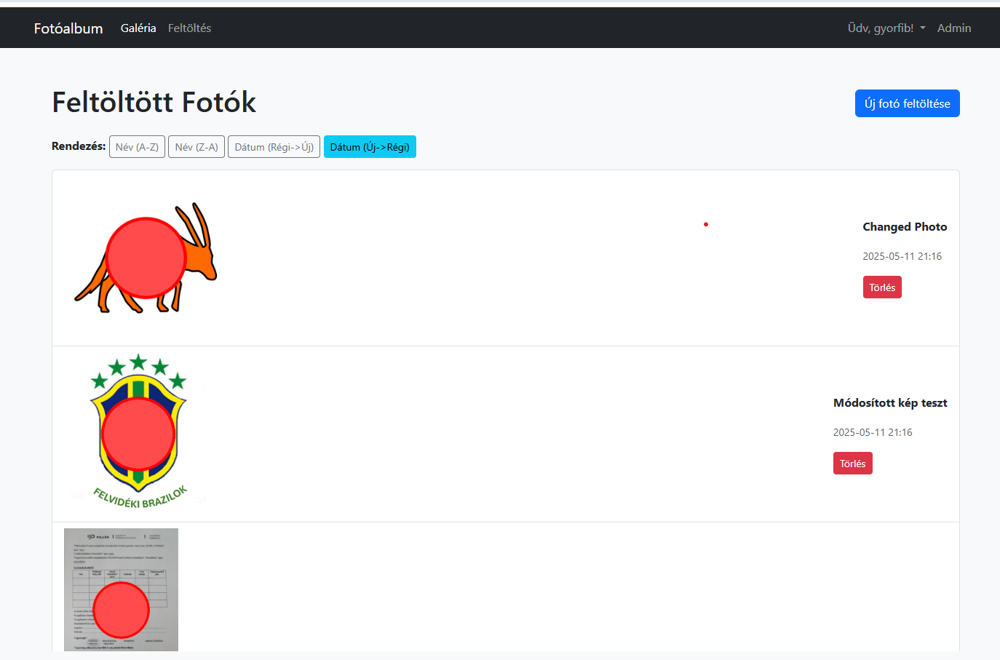
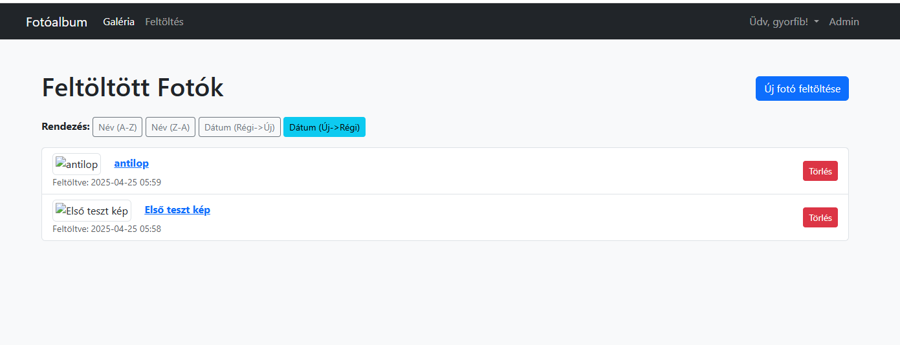

# Django Fotóalbum - Felhő Labor Task 6: Serverless Képfeldolgozás AWS Szolgáltatásokkal

## Leírás

Ez a 6. feladat a meglévő Django fotóalbum alkalmazást bővíti egy szerver nélküli (serverless) képfeldolgozó funkcionalitással, AWS szolgáltatások (API Gateway, Lambda, S3) felhasználásával. A cél az volt, hogy a feltöltött képeken egy egyszerű manipulációt, egy piros kör rárajzolását csináljuk meg és a feldolgozott képet tároljuk és jelenítsük meg.

## Megvalósított Architektúra és Működés

A képfeldolgozás folyamata a következőképpen épül fel:

1.  **Képfeltöltés Django-n keresztül:** A felhasználó a Django alkalmazás webes felületén keresztül tölti fel a képet.
2.  **Adattovábbítás az API Gateway-hez:**
    * A Django view (`PhotoCreateView`) fogadja a fájlt.
    * A fájl tartalmát base64 formátumba kódolja.
    * A base64 kódolt adatot és a fájlnevet HTTP POST kéréssel elküldi egy előre konfigurált AWS API Gateway végpontra.
3.  **AWS API Gateway:**
    * Fogadja a Django-tól érkező kérést.
    * Meghívja (triggereli) a háttérben futó AWS Lambda függvényt, átadva neki a kérés tartalmát (a base64 kódolt képet és a fájlnevet).
4.  **AWS Lambda Függvény:**
    * Python futtatókörnyezetben fut.
    * Fogadja az API Gateway-től az adatokat.
    * Dekódolja a base64 stringet vissza bináris képpé.
    * A **Pillow** könyvtár segítségével elvégzi a képmanipulációt (egy piros kör rárajzolása).
    * A feldolgozott képet elmenti egy dedikált AWS S3 bucket `processed/` mappájába, egyedi generált kulccsal (fájlnévvel).
    * Visszaad egy JSON választ az API Gateway-nek, ami tartalmazza a sikeres feldolgozás tényét és a feldolgozott kép S3 kulcsát.
5.  **Válaszfeldolgozás Django-ban:**
    * A Django view fogadja az API Gateway (Lambda) válaszát.
    * Sikeres feldolgozás esetén kinyeri a válaszból a feldolgozott kép S3 kulcsát.
    * Ezt az S3 kulcsot elmenti a `Photo` modell `processed_s3_key` mezőjébe az adatbázisban.
6.  **Megjelenítés:**
    * A Django `Photo` modell `display_image_url` property-je a mentett `processed_s3_key` és a konfigurált S3 bucket információk alapján generálja a feldolgozott kép teljes S3 URL-jét.
    * A Django template-ek (pl. `photo_list.html`) ezt az URL-t használják az `` tag `src` attribútumában a feldolgozott kép megjelenítésére.

## Felhasznált AWS Szolgáltatások és Egyéb Technológiák

* **AWS Lambda:** Szerver nélküli számítási környezet a képfeldolgozó Python kód futtatásához.
    * Python 3.12 futtatókörnyezet.
    * **Pillow** könyvtár a képmanipulációhoz (a Lambda deployment csomagba vagy Layer-ként integrálva).
    * Boto3 (AWS SDK for Python) az S3 műveletekhez.
* **AWS API Gateway:** HTTP API végpont létrehozása a Lambda függvény elérhetővé tételéhez. REST API típust használtunk.
* **AWS S3 (Simple Storage Service):** A feldolgozott képek tárolására (`djangophotoalbumbucket` nevű bucket, `processed/` prefix alatt).
* **AWS IAM (Identity and Access Management):** A Lambda függvény végrehajtási szerepkörének (execution role) jogosultságainak kezelése (pl. `s3:PutObject` a cél bucket-re, CloudWatch logolási jogok).
* **AWS CloudWatch:** A Lambda függvény naplóinak (logok) és metrikáinak gyűjtése, monitorozása, hibakeresés.
* **Django Módosítások:**
    * `requests` könyvtár HTTP kérésekhez az API Gateway felé.
    * Base64 kódolás/dekódolás.
    * View-k, Form-ok és Model-ek frissítése az új folyamat támogatásához.
* **Hibakezelés:** A Django és Lambda oldalon is naplózás (`logging` modul, `print` utasítások a CloudWatch-ba) és hibakezelő blokkok kerültek beépítésre a folyamat során felmerülő problémák azonosítására és kezelésére.

## Változások az előző állapothoz képest

* A képek feltöltésekor már nem csak az adatbázisba kerül bejegyzés, hanem a kép szerveroldali feldolgozáson esik át egy külső, szerver nélküli szolgáltatás (AWS Lambda) segítségével.
* A feldolgozott képek egy AWS S3 bucketben kerülnek tárolásra.
* Az alkalmazás a feldolgozott képeket jeleníti meg az S3-ból.
* Az architektúra kibővült az AWS API Gateway, Lambda és S3 szolgáltatásokkal, demonstrálva a felhőalapú, mikroszolgáltatás-szerű kiterjesztési lehetőségeket.

---

# Django Fotóalbum - Felhő Labor Task 5

## Leírás

Mostmár működik a developer sandboxban is a Django Fotóalbum alkalmazás, Postgresql adatbázissal.

# Django Fotóalbum - Felhő Labor Task 4

## Leírás

Egy egyszerű Django alapú fotóalbum alkalmazás, amely lehetővé teszi regisztrált felhasználók számára képek feltöltését, megtekintését és törlését. Ez a projekt a BME VIK Felhőalapú Szolgáltatások laboratórium 4. feladatának (Task 4) beadandó verziója, amely SQLite adatbázist használ és OpenShift Developer Sandboxban fut.

Jelenleg még csak lokálisan működik a képek perzisztens tárolása.

## Funkciók (Jelenlegi állapot - Task 4)

* Felhasználói regisztráció
* Felhasználói bejelentkezés / kijelentkezés
* Fotó feltöltése (csak bejelentkezett felhasználóknak)
* Fotók listázása (név és dátum szerint rendezhető)
* Fotó részleteinek megtekintése
* Saját fotó törlése (csak bejelentkezett felhasználóknak)
* Reszponzív felület (Bootstrap 5 használatával)
* Automatikus build és deployment OpenShift-re `git push` után (GitHub Webhook)

## Technológiai Stack

* **Backend:** Python 3.10, Django 5.2
* **Adatbázis:** SQLite (OpenShift Perzisztens Köteten (PVC) tárolva)
* **Frontend:** HTML, CSS, Bootstrap 5 (CDN)
* **Konténerizáció:** Docker, Docker Compose (lokális fejlesztéshez)
* **Platform:** OpenShift Developer Sandbox
* **WSGI Szerver:** Gunicorn
* **Statikus fájlok:** Whitenoise
* **Verziókezelés & CI/CD:** Git, GitHub, GitHub Webhook OpenShift Trigger

## Demó

Az alkalmazás jelenlegi verziója elérhető az OpenShift Developer Sandboxban:

**[https://https://final-django-app-gyorfibence-dev.apps.rm3.7wse.p1.openshiftapps.com](https://https://final-django-app-gyorfibence-dev.apps.rm3.7wse.p1.openshiftapps.com)**

## Képernyőképek

* **Listanézet**

* **Fotó feltöltése**

* **Regisztráció**

* **Bejelentkezés**

